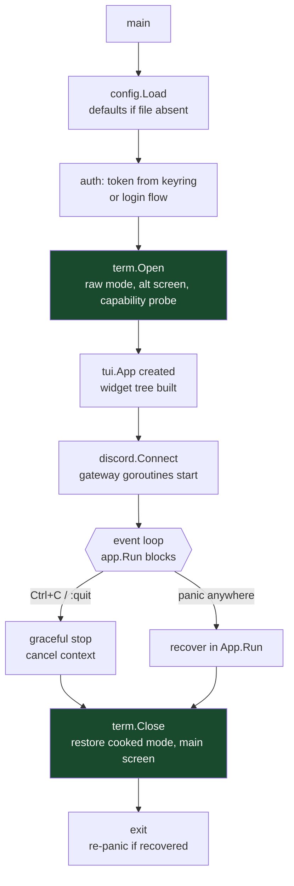
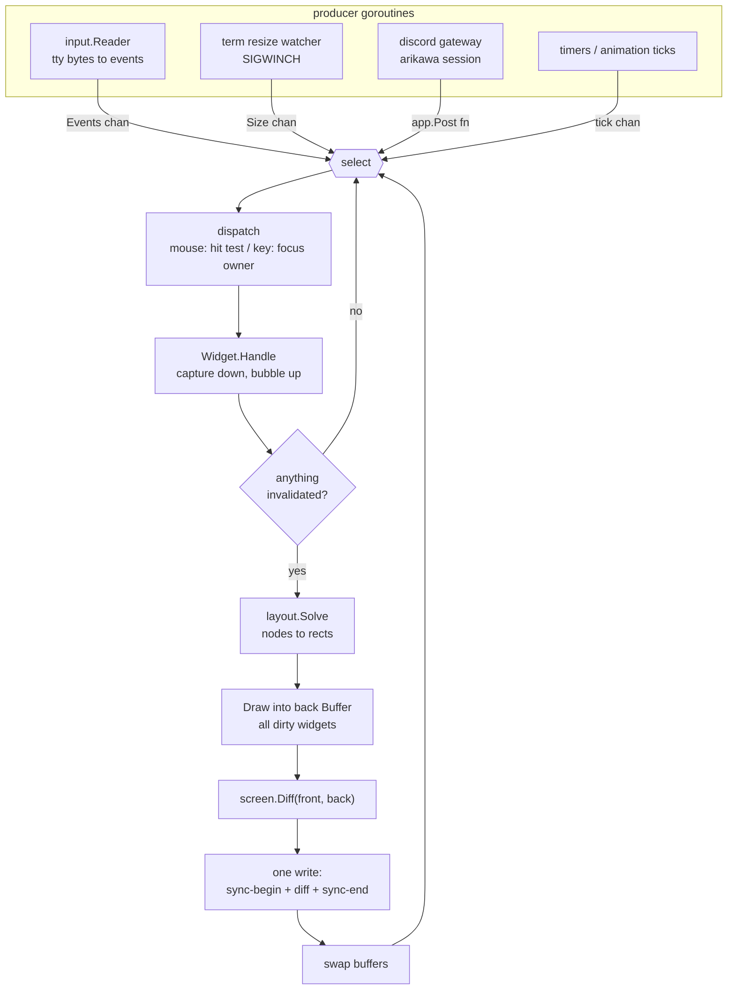
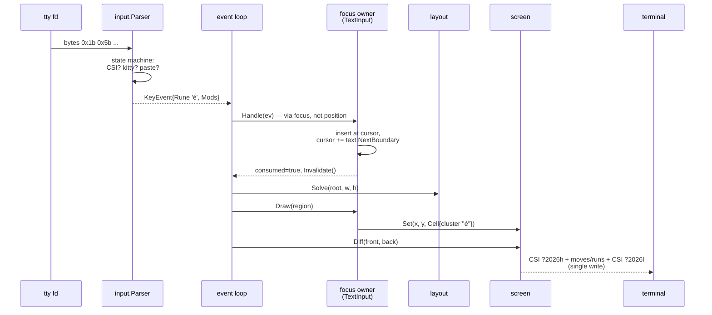
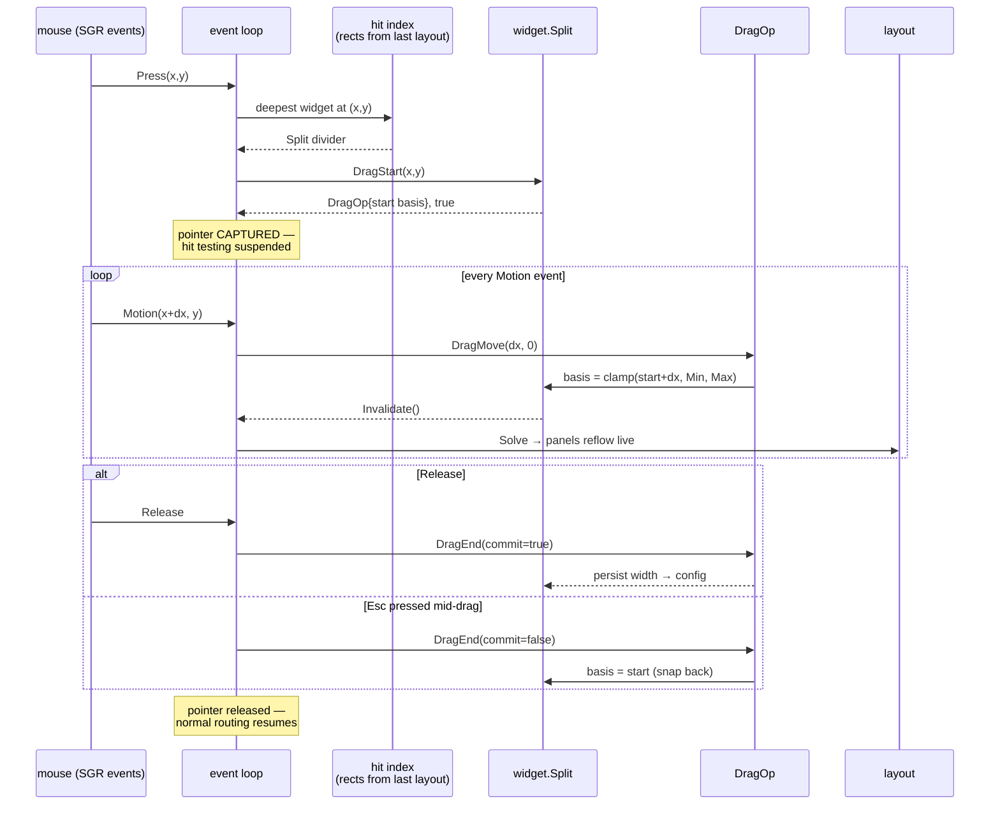
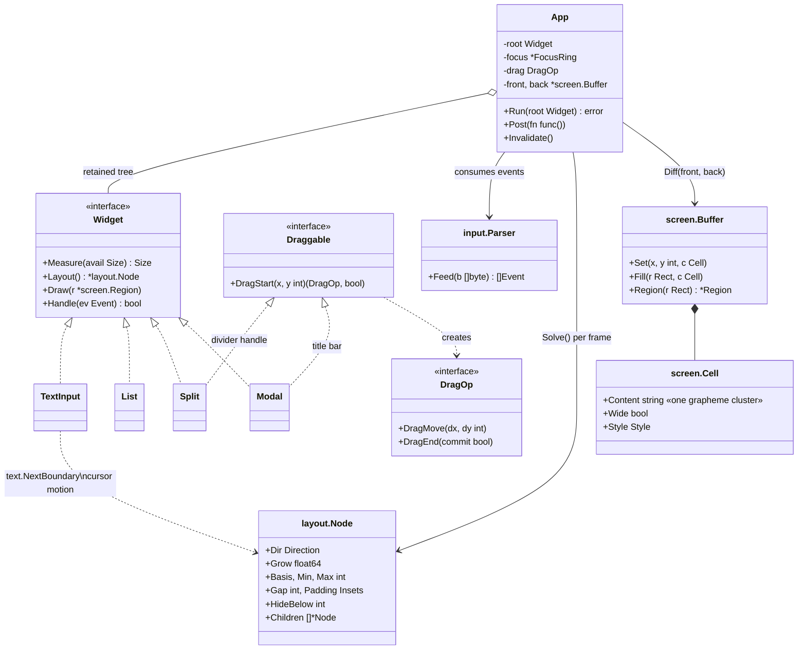
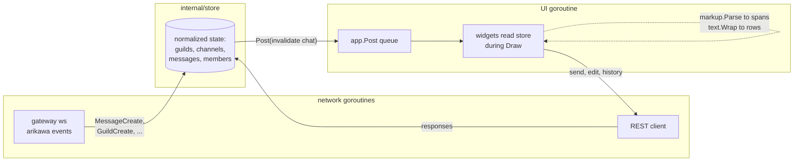
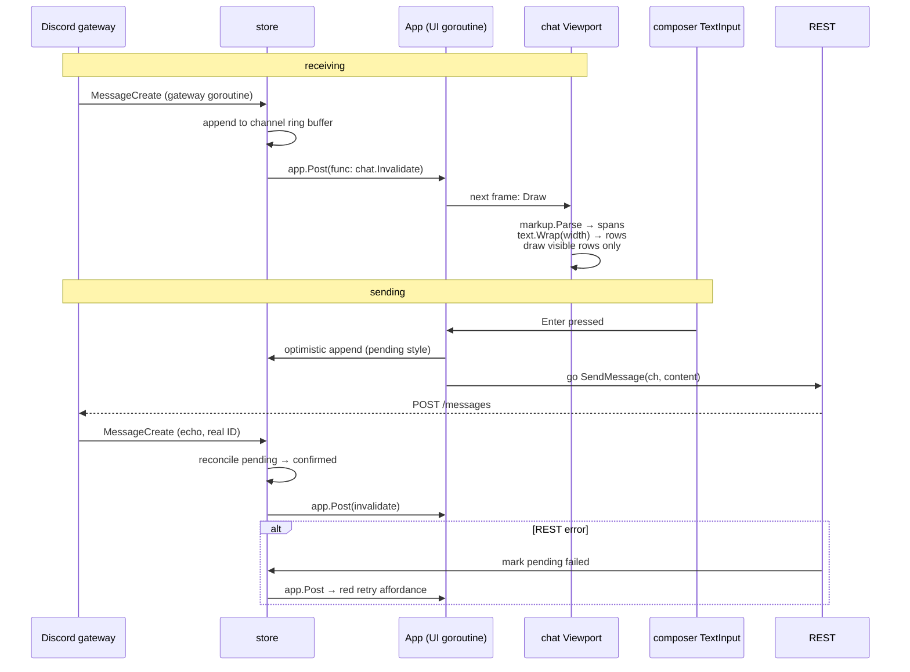

# Plan — a Modern Go TUI library + Discord client

Two deliverables in one repo, built bottom-up:

1. **The library** (`internal/tui/...`) — a from-scratch, Modern terminal UI
   framework: flexbox layout, full mouse support with **draggable/resizable
   elements**, Kitty keyboard protocol, flicker-free diff rendering. You
   implement it (this is the Go practice); the `text` package is already done
   and is the one part nobody should have to write twice.
2. **The client** (`internal/app`, `cmd/`) — a Discord TUI on top of it,
   using the existing `internal/auth`, `internal/keyring`, `internal/discord`
   (arikawa) foundation.

Lessons carried from tuicord: the rune-width discipline stays (now
grapheme-cluster based), the 25-package UI sprawl and string-sentinel markup
hacks do not. Parse once into spans; never smuggle metadata through strings.

---

## Ground rules

- **Docs are a feature.** Every package ships a package comment that explains
  *why it exists and how to hold it*, godoc on every exported symbol, and an
  `example_test.go` with runnable `Example*` functions (they compile and run
  in CI — docs that can't rot). `internal/tui/text` is the template.
- **Cells, not runes.** All layout math flows through `internal/tui/text`.
  `len(s)` and `[]rune(s)` are banned in drawing/layout code.
- **Small files, small packages.** One concern per package, 200–400 lines per
  file, no package may import a "higher" layer (see the dependency arrow
  below).
- **Pure cores, thin shells.** Parsers, layout solvers, and diffing are pure
  functions over plain data → table-driven tests. Only `term` touches the
  real terminal.
- **TDD where it pays.** `input` parser, `layout` solver, `screen` diff, and
  `text` are golden-test territory (80%+). The event loop and widgets are
  verified by example programs.

## What "Modern (capital M)" means here

| Feature | Mechanism |
|---|---|
| Draggable & resizable elements | SGR mouse motion tracking + hit testing + pointer capture |
| Rich keyboard | Kitty keyboard protocol (disambiguated `Ctrl+Shift+T`, key release) with legacy fallback |
| Flicker-free | Double buffer, frame diff, synchronized output (`CSI ?2026`), one `write()` per frame |
| Truecolor | 24-bit color with automatic 256/16 degradation, `NO_COLOR` respected |
| Graceful input | Bracketed paste (paste never triggers keybinds), focus in/out events, unknown sequences swallowed |
| Flex layout | Grow/shrink/basis/min/max/gap, breakpoint helper (`HideBelow`) for responsive panels |
| Overlays | Z-ordered layers: base UI → dropdowns → modals → drag ghost |

---

## Library architecture

Dependency arrow points down only:

```
internal/tui/
  text/     ✅ DONE — grapheme clusters, cell widths, wrap/truncate/pad
  term/     raw mode, capability probe, restore-on-panic, SIGWINCH
  input/    bytes → events (keys, mouse, paste, focus)
  screen/   cell buffer, frame diff, ANSI emitter
  layout/   flexbox solver (pure math: nodes in, rects out)
  tui/      widget interface, event loop, focus, drag manager  ("app" layer)
  widget/   Text, TextInput, List, Scroll, Border, Modal, Split
```

### `text` — done, the contract

`Width`/`ClusterWidth` (cells), `Clusters` (an `iter.Seq` — the only legal
way to walk user text), `Truncate`/`PadLeft`/`PadRight`/`Wrap`/`ExpandTabs`,
`NextBoundary`/`PrevBoundary` for cursors. Handles VS15/VS16, ZWJ sequences,
flags, skin tones, keycaps, CJK, the emoji-presentation blocks go-runewidth
gets wrong, and control-rune stripping. 93.6% covered, examples included.
Everything above consumes this; nothing above re-measures.

### `term` — the only package that touches the tty

```go
t, err := term.Open()          // raw mode, alt screen, queries capabilities
defer t.Close()                 // ALWAYS restores — also wired to panic paths
t.Caps()                        // .TrueColor, .KittyKeyboard, .SyncOutput ...
t.Resizes() <-chan term.Size    // SIGWINCH, coalesced
t.Write(frame []byte)           // single batched write
```

Capability probing: `COLORTERM`/`TERM` env, then live queries (Kitty keyboard
`CSI ?u`, synchronized output `DECRQM 2026`) with a short deadline.
**Non-negotiable:** `Close` is idempotent and runs on panic — a TUI that
wrecks the shell on crash is disqualifying.
*Go practice: syscalls via `x/term`, signal handling, `defer`/`recover` discipline.*

### `input` — pure parser + reader goroutine

Two halves, deliberately separated:

- `input.Parser` — **pure**: feed bytes, get events. No IO, no goroutines.
  Table-driven tests with recorded byte sequences (steal tuicord/libgoflex
  testdata). Handles: Kitty keyboard sequences, legacy ESC sequences (with
  the ESC-vs-Alt timing ambiguity resolved by a deadline), SGR-1006 mouse
  (press/release/**motion**/wheel), bracketed paste, focus in/out. Unknown
  sequences are consumed and dropped, never leaked as garbage keystrokes.
- `input.Reader` — goroutine owning the fd: `Events() <-chan input.Event`,
  shut down via `context.Context`.

```go
type KeyEvent   struct { Key Key; Mods Mod; Rune rune; Release bool }
type MouseEvent struct { X, Y int; Btn Button; Mods Mod; Kind MouseKind } // Press|Release|Motion|Wheel
type PasteEvent struct { Text string } // delivered atomically, one event
```

*Go practice: state machines, goroutines + channels + context, table tests.*

### `screen` — cell grid, diff, ANSI out

```go
type Cell struct { Content string /* one grapheme cluster */; Wide bool; Style Style }
type Buffer struct { ... }      // Set(x, y, Cell), Fill(rect), Clip
func Diff(prev, next *Buffer) []byte  // minimal ANSI: cursor moves + runs
```

Rules learned the hard way:
- A cell stores a **cluster string**, not a rune — combining marks and VS16
  travel with their base glyph or terminals render the wrong presentation.
- Wide glyphs occupy two cells; the right half is a continuation marker the
  emitter must *skip*, not overwrite with a space (kitty corrupts otherwise).
- Frame = `sync-begin + diff + sync-end`, one write. Overwrite, never
  `CSI 2J` clear.
*Go practice: performance-aware data layout, benchmarks (`go test -bench`), fuzzing the differ against a naive renderer.*

### `layout` — flexbox as a pure function

```go
type Node struct {
    Dir        Direction  // Row | Column
    Grow       float64
    Basis      int        // cells; 0 = from content
    Min, Max   int
    Gap        int
    Padding    Insets
    HideBelow  int        // responsive: drop when container narrower
    Children   []*Node
}
func Solve(root *Node, w, h int) map[*Node]Rect
```

No draw calls, no terminal — rects in, rects out. Golden tests assert exact
rectangles for nested trees at 80×24, 120×40, 200×60.
*Go practice: recursion, two-pass algorithms (measure then arrange), property tests (children never exceed parent).*

### `tui` — the runtime (widget interface, loop, drag)

```go
type Widget interface {
    Measure(avail Size) Size
    Layout() *layout.Node
    Draw(s *screen.Region)
    Handle(ev Event) bool     // true = consumed
}
```

Retained tree + invalidation (dirty flag bubbles up, next frame redraws).
The loop is one `select`: input events, resize, timers/animation ticks,
`app.Post(func())` for goroutine-safe UI updates (this is how gateway events
reach the UI — **the Discord goroutines never touch widgets directly**).

**Hit testing & routing:** after layout, keep the widget-rect index. Mouse
events route to the deepest widget under the pointer (capture phase down,
bubble up). Keyboard goes to the focus owner; `Tab`/`Shift+Tab` walk the
focus ring.

**The drag manager** — the Modern centerpiece, one small state machine:

```go
// Any widget can offer drag behaviors:
type Draggable interface {
    DragStart(x, y int) (DragOp, bool)  // hit a handle? return an op
}
type DragOp interface {
    DragMove(dx, dy int)   // called on every motion event
    DragEnd(commit bool)   // Esc cancels ⇒ commit=false, snap back
}
```

Press → hit test finds a `Draggable` → pointer is **captured** (all motion
goes to the op, nothing else) → release ends it. Built on this, for free:

- `widget.Split` — draggable divider between panels (sidebar resize), with
  keyboard fallback (`Alt+←/→` when divider focused) and min/max clamping
  from the flex node.
- `widget.Modal` — draggable by its title bar, snaps inside the screen.
- Cursor-shape hints (`CSI 22 q` family / OSC) where the terminal supports it.

*Go practice: interfaces & composition, select loops, state machines, API design taste.*

### `widget` — the starter set

Text (spans, wrapped, from `text.Wrap`), TextInput (grapheme cursor via
`NextBoundary`/`PrevBoundary`, paste-aware, horizontal scroll), List/Viewport
(virtualized: draw only visible rows), Border/Title, Split (drag-resizable),
Modal (focus trap + draggable). Nothing else until the client demands it.

---

## The DEVEX bar

If this program doesn't stay this small, the API failed:

```go
func main() {
    cfg := config.Load()                       // defaults if file absent
    app := tui.New(tui.WithTheme(cfg.Theme))

    sidebar := widget.NewList(guilds)
    chat    := widget.NewViewport()
    input   := widget.NewTextInput("message #general…")

    root := tui.Column(
        tui.Row(
            tui.Split(sidebar, chat).Basis(24).MinLeft(16).MaxLeft(48), // drag me
        ).Grow(1),
        input,
    )
    app.Run(root)                              // blocks; Ctrl+C restores terminal
}
```

Per-package `examples/` directory with runnable demos — `examples/drag`,
`examples/flex`, `examples/input-inspector` (prints decoded events; doubles
as a debugging tool). These are the library's documentation *and* its manual
test rig.

---

## The client on top

```
internal/app/        session orchestration: gateway → store → app.Post(ui update)
internal/store/      normalized state: guilds, channels, messages, members
internal/markup/     Discord markdown → []Span{Text|Emoji|Mention|Link|Code}
internal/config/     TOML: ~/.config/<name>/config.toml (+ [keys], [theme])
cmd/<name>/main.go
```

Look & feel — persistent multi-panel, fixed spatial positions, both sidebars
drag-resizable, members panel auto-hides under 120 cols:

```
┌ Guilds ─┬ Channels ──┬ #general — Gopher Den ────────────┬ Members ──┐
│ ● Den   ││ ▾ TEXT    ││ jules  Today 14:02                │ ● jules   │
│   Work  ││ > #general││   did you see the new gateway?    │ ● mira    │
│   OSS   ││   #dev    ││ mira   14:03                      │ ○ sam     │
│         ││ ▾ VOICE   ││   yeah, **resume** works now 🎉   │           │
│         ││   ~lounge ││ jules  14:04  ship it             │           │
├─────────┴┴───────────┴┴───────────────────────────────────┴───────────┤
│ > reply to mira…                                                      │
│ [Tab]panel [/]search [Ctrl+K]jump [?]help              ⟨connected⟩    │
└────────────────────────────────────────────────────────────────────────┘
   ↑ the ││ dividers are drag handles (and Alt+arrows when focused)
```

Interaction model: composer always live (typing types a message, like
Discord), `Tab` cycles panels, `Ctrl+K` quick-switcher, `Esc` = back to
composer, `?` help overlay. No vim modes in v1.

Config stays boring:

```toml
theme = "dark"            # dark | light | mono
[layout]
guilds_width = 10
channels_width = 24
members = "auto"          # auto | show | hide
[keys]
quick_switch = "ctrl+k"
```

## Markup v2 (client-side, not library)

One parse: Discord markdown + `<@id>`/`<#id>`/`<:name:id>` → `[]Span`. Spans
carry kind + style + payload; the renderer maps spans → styled clusters →
`text.Wrap`. No regex rewrite passes, no private-use sentinel runes. Emoji
render as `:name:` text in v1; the span already carries the CDN URL so the
image milestone only touches the renderer.

---

## Diagrams — how it works, level by level

### L0 · Process lifecycle (flow)

The outermost truth: exactly one path in, and *every* path out goes through
terminal restore.



### L1 · The runtime loop (flow)

One goroutine owns the UI. Everything else talks to it through channels or
`app.Post`. A frame is drawn only when something is dirty — idle costs zero.



### L1 · One keypress, end to end (sequence)



### L1 · Drag a sidebar divider (sequence)

The pointer-capture rule is the whole trick: between press and release, the
drag op is the *only* recipient of motion.



### L1 · Input parser (state)

Pure state machine — this diagram *is* the test plan for `input.Parser`.

```mermaid
stateDiagram-v2
    [*] --> Ground
    Ground --> Ground: printable / UTF-8\n→ KeyEvent(rune)
    Ground --> Esc: 0x1b
    Esc --> Ground: timeout deadline\n→ KeyEvent(Esc)
    Esc --> Ground: printable\n→ KeyEvent(Alt+rune)
    Esc --> CSI: '['
    Esc --> SS3: 'O'
    SS3 --> Ground: final byte\n→ KeyEvent(F1..F4, arrows)
    CSI --> CSI: params 0-9 ; : < ? u
    CSI --> Ground: final 'u'\n→ Kitty KeyEvent(+mods, release)
    CSI --> Ground: final 'M'/'m'\n→ SGR MouseEvent
    CSI --> Paste: "200~"
    CSI --> Ground: 'I'/'O'\n→ FocusEvent
    CSI --> Ground: unknown final\n→ swallowed, never leaked
    Paste --> Paste: any bytes (buffered)
    Paste --> Ground: ESC "[201~"\n→ one atomic PasteEvent
```



### L2 · Library core (class)



### L3 · Client dataflow (flow)

The one rule: Discord goroutines never touch widgets. They mutate the store,
then hand the UI a closure via `app.Post`.



### L3 · Receiving and sending a message (sequence)



## Milestones

Each ends with something runnable. Order = dependency order; 2 and 3 can
proceed in parallel after 1.

1. **`term` + `input`** → `examples/input-inspector` shows every key/mouse/
   paste event decoded, on kitty *and* a legacy terminal, inside tmux.
2. **`screen`** → bouncing-box demo, zero flicker, emoji + CJK draw clean.
3. **`layout`** → golden tests at three sizes; `examples/flex` renders
   colored boxes that reflow on resize.
4. **`tui` runtime + first widgets** → `examples/drag`: two panels, a
   draggable divider, a draggable modal, focus ring. *Library v0 done.*
5. **Client skeleton** — login (existing auth/keyring), guild+channel lists,
   read-only message view via gateway. First daily-drivable build.
6. **Composer + markup v2** — send messages, spans render, TextInput
   survives the paste-an-essay-with-emoji test.
7. **Comfort ring** — quick-switcher, unread badges, `?` help, themes.
8. **Later ring** (explicitly out of v1): images/avatars via Kitty graphics,
   reactions, threads, voice status, notifications.

## Definition of done, per package

- [ ] Package comment says why it exists and shows the 10-second usage
- [ ] `example_test.go` with runnable examples for the main entry points
- [ ] Table/golden tests for the pure core (target 80%+; `text` sits at 93%)
- [ ] An entry under `examples/` if the package does anything visible
- [ ] Survives: tmux, 80×24, resize spam, `NO_COLOR`, a CJK+emoji paste
- [ ] `go vet` + modernize lints clean
